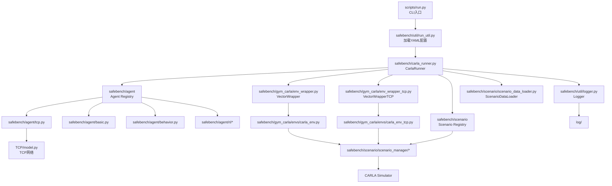

# GUISafeBenchHK

基于 CARLA 的自动驾驶安全评测与对抗场景实验仓库，在 [SafeBench](https://github.com/trust-ai/SafeBench) 框架基础上扩展，集成了 TCP（Trajectory-guided Control Prediction）端到端驾驶模型，并新增 GUI 控制台用于可视化管理评测实验。

核心功能：

- 多种被测自车策略（`basic`、`behavior`、`sac`、`ppo`、`tcp` 等）
- 多种对抗/标准场景策略（`standard`、`lc`、`nf` 等）
- 交互式场景构建工具，支持自定义地图、路线和 Trigger 配置
- 浏览器 GUI，可视化管理评测任务

## 前提条件

| 依赖 | 要求 |
|---|---|
| OS | Linux（推荐 Ubuntu 22.04） |
| Python | 3.8+ |
| CUDA | 11.7（`requirements.txt` 锁定 `torch 1.13.1+cu117`） |
| CARLA Simulator | 与仓库匹配的版本（需单独安装） |
| CARLA Python API | 与 CARLA Simulator 版本一致 |
| Node.js | 18+（仅 GUI 控制台需要） |

> **注意**：`requirements.txt` 中 PyTorch 依赖硬编码为 CUDA 11.7 版本。若 CUDA 版本不同，请在安装前手动修改 `requirements.txt` 中的 `--extra-index-url` 和 `torch` 版本，再执行安装。

## 安装

### 第 1 步：克隆仓库

本仓库用 **Git LFS** 管理模型权重文件（`.ckpt`、`.pt`、`.pth`），克隆前需安装 `git-lfs`，否则权重文件只会是 pointer，运行时会报错。

```bash
git lfs install
git clone <repo-url>
cd GUISafeBenchHK

# 若克隆后权重文件仍为 pointer，手动拉取
git lfs pull
```

### 第 2 步：创建 conda 环境并安装 Python 依赖

创建 **Python 3.8** 的独立 conda 环境，避免依赖版本锁定与其他项目冲突。后续 CARLA Python API 也需要安装到同一环境，因此 Python 版本必须与编译 CARLA 时一致。

```bash
conda create -n safebench python=3.8 -y
conda activate safebench

pip install -r requirements.txt
pip install -e .
```

> `pip install -e .` 让 `safebench` 包可在仓库根目录外被直接导入，是必须执行的步骤。

### 第 3 步：编译安装 CARLA 并将 Python API 装入同一环境

参考 [CARLA 官方文档](https://carla.readthedocs.io) 完成 CARLA Simulator 的编译安装。编译完成后，将生成的 Python API wheel 安装到上一步创建的 `safebench` conda 环境中：

```bash
conda activate safebench
pip install /path/to/carla/PythonAPI/carla/dist/carla-*-cp38-cp38-linux_x86_64.whl
```

> **重要**：CARLA Python API 的 wheel 文件名中包含 Python 版本标记（如 `cp38`），必须与 conda 环境的 Python 版本完全一致，否则安装会失败或运行时报 import 错误。若编译时使用的是其他 Python 版本，需相应调整第 2 步的 `conda create` 命令。

### 第 4 步：安装 GUI 控制台依赖

仅在首次使用 GUI 控制台时需要（与核心评测功能无关，可跳过）：

```bash
# 后端 Python 依赖（FastAPI、uvicorn 等，与 requirements.txt 分离，按需安装）
pip install -r gui_console/backend/requirements.txt

# 前端 Node.js 依赖
sudo apt install npm
cd gui_console/frontend && npm install && cd ../..
```

## 快速上手

### 前提：启动 CARLA

本仓库不会自动启动 CARLA，需要先在本机或远端启动 CARLA Server，默认端口 `2000`（Traffic Manager `8000`）。

### 运行第一次评测

以下命令使用内置的 `behavior` 策略和 `standard.yaml` 场景配置跑一次评测，不开渲染窗口、不保存视频，适合快速验证环境是否配置正确：

```bash
python scripts/run.py \
  --mode eval \
  --agent_cfg behavior.yaml \
  --scenario_cfg standard.yaml \
  --exp_name behavior_standard_eval \
  --render false \
  --save_video false
```

评测结果写入：

```
log/behavior_standard_eval/behavior_standard_eval_behavior_standard_seed_0/
├── runtime.log          # 运行过程日志
├── progress.txt         # 表格化指标
└── eval_results/
    ├── results.pkl      # 汇总结果
    └── batch_results.jsonl
```

## 运行参数说明

### Agent（`--agent_cfg`）

| 配置文件 | 策略类型 |
|---|---|
| `basic.yaml` | 规则型基础跟车 |
| `behavior.yaml` | CARLA 内置 BehaviorAgent |
| `tcp.yaml` | TCP 端到端模型（需 GPU，权重由 LFS 提供） |
| `ppo.yaml` / `sac.yaml` / `ddpg.yaml` / `td3.yaml` | 强化学习策略 |
| `dummy.yaml` | 静止/空策略，用于场景调试 |

### 场景（`--scenario_cfg`）

| 配置文件 | 场景策略 | 说明 |
|---|---|---|
| `standard.yaml` | `standard` | 标准功能场景，使用 scenario_runner 范式定义 |
| `LC.yaml` | `lc` | 对抗场景，使用遗传算法生成对抗行为 |

### 运行模式（`--mode`）

| 模式 | 说明 |
|---|---|
| `eval` | 评测模式，跑完输出结果 |
| `train_agent` | 训练自车 RL 策略 |
| `train_scenario` | 训练对抗场景策略 |

### 常用参数

```bash
python scripts/run.py \
  --mode eval \
  --agent_cfg tcp.yaml \
  --scenario_cfg LC.yaml \
  --exp_name my_exp \
  --port 2000 \          # CARLA 端口
  --tm_port 8000 \       # Traffic Manager 端口
  --num_scenario 1 \     # 每 episode 并行场景数
  --render false \
  --save_video false
```

> `scenario_id` 和 `route_id` 不通过命令行指定，而是在 `safebench/scenario/config/*.yaml` 中设置（`null` 表示跑全部）。

## 目录结构

```
scripts/run.py                    # 命令行入口
safebench/
  carla_runner.py                 # 总调度器
  agent/                          # 自车策略（+ config/*.yaml）
  scenario/                       # 场景策略、数据、定义（+ config/*.yaml）
  gym_carla/                      # CARLA Gym 风格环境封装
  util/                           # 日志、配置、指标等工具
TCP/                              # TCP 模型代码与权重
tools/CarlaScenariosBuilder/      # 交互式场景构建工具
gui_console/                      # 浏览器 GUI（FastAPI + React）
log/                              # 评测结果输出（运行时生成）
```

## 架构概览



## GUI 控制台

提供浏览器界面，可视化管理评测任务（Step 0 环境检查 → Step 7 结果查看），由 FastAPI 后端（`:8001`）和 Vite/React 前端（`:5173`）组成。

```bash
# 一键启动
bash gui_console/bin/start_console.sh

# 停止
bash gui_console/bin/stop_console.sh
```

启动后访问 `http://127.0.0.1:5173`。详细使用说明见 [doc/GUI/build_gui.md](doc/GUI/build_gui.md)。

## 延伸阅读

- [doc/manual/user_manual.md](doc/manual/user_manual.md)：完整使用手册，含自定义场景制作全流程
- [doc/manual/module_relationship.md](doc/manual/module_relationship.md)：各模块代码层级关系详解
