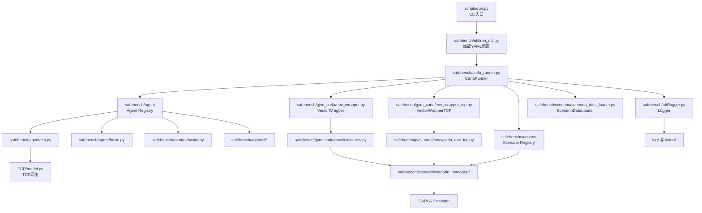

# SafeBenchHK-zh-simulate-tag

面向 CARLA 的自动驾驶安全评测与对抗场景实验仓库。

该仓库以 `safebench` 为核心框架，统一组织：

- 被测自动驾驶策略（`basic`、`behavior`、`sac`、`ppo`、`tcp` 等）
- 对抗/标准场景策略（`standard`、`random`、`lc`、`nf` 等）
- CARLA 环境包装、日志、视频与评测结果
- TCP（Trajectory-guided Control Prediction）模型集成

## 目录概览

- [scripts/run.py](scripts/run.py)：命令行入口
- [safebench/carla_runner.py](safebench/carla_runner.py)：总调度器
- [safebench/agent](safebench/agent)：自车策略
- [safebench/scenario](safebench/scenario)：场景生成/管理/评测
- [safebench/gym_carla](safebench/gym_carla)：CARLA Gym 风格环境封装
- [safebench/util](safebench/util)：日志、配置、指标等工具
- [TCP](TCP)：外部 TCP 模型与其依赖代码
- [log](log)、[video](video)：实验产物

## 运行主链路

1. [scripts/run.py](scripts/run.py) 解析参数并加载 YAML 配置
2. [safebench/carla_runner.py](safebench/carla_runner.py) 创建 `CarlaRunner`
3. `CarlaRunner` 加载地图、渲染器、Agent、Scenario Policy
4. 通过 `VectorWrapper` / `VectorWrapperTCP` 构建并行 CARLA 环境
5. 在 `train_agent`、`train_scenario` 或 `eval` 模式下执行训练/评测
6. 结果写入 `log/`，可选输出视频到 `video/`

## 模块关系图

详见 [doc/module_relationship.md](doc/module_relationship.md)。

## 使用手册

正式使用手册见 [doc/user_manual.md](doc/user_manual.md)。



## 当前整理项

本次已做的结构整理：

1. 将 `setup.py` 改为自动发现 `safebench` 子包
2. 将 TCP 模型配置改为仓库内相对路径
3. 让 TCP 环境包装器切换逻辑基于 `policy_type`，而不是配置文件名
4. 增加根文档和模块关系图，便于后续维护

## 克隆与初始化

本仓库使用 **Git LFS** 管理大体积模型权重文件（`.ckpt`、`.torch`、`.pt`、`.pth`），
克隆时需要额外步骤，否则模型文件将只是 LFS pointer，运行时会报错。

```bash
# 1. 确保本地安装了 git-lfs
git lfs install

# 2. 克隆仓库（会自动拉取 LFS 文件）
git clone <repo-url>

# 3. 若克隆后 LFS 文件仍为 pointer，手动拉取
git lfs pull
```

克隆完成后，按以下步骤初始化环境：

```bash
# 4. 安装 Python 依赖（可编辑模式）
pip install -r requirements.txt
pip install -e .

# 5. 安装前端依赖（仅使用 GUI 控制台时需要）
cd gui_console/frontend && npm install
```

> `gui_console/runtime/`（实验记录、状态文件）在后端首次启动时自动创建，无需手动操作。
> `log/`、`video/` 为运行时输出目录，不纳入版本控制。

## 安装建议

该仓库强依赖 CARLA 及其 Python API。建议按以下顺序配置：

1. 安装与项目匹配的 CARLA Simulator
2. 安装 CARLA Python API
3. 安装 Python 依赖：
   - 优先使用 [requirements.txt](requirements.txt)
4. 在仓库根目录执行可编辑安装：
   - `pip install -e .`

> 说明：`setup.py` 主要用于让 `safebench` 包可被本地导入；完整实验环境仍以 `requirements.txt` 与 CARLA 运行环境为准。

## 典型入口参数

默认入口文件是 [scripts/run.py](scripts/run.py)。当前默认配置偏向：

- Agent: `tcp.yaml`
- Scenario: `LC.yaml`
- Mode: `eval`

后续如果要继续整理，建议优先补充：

- CARLA 版本与端口约定
- 数据集/场景配置来源说明
- 各 `agent/config/*.yaml` 与 `scenario/config/*.yaml` 的用途说明
