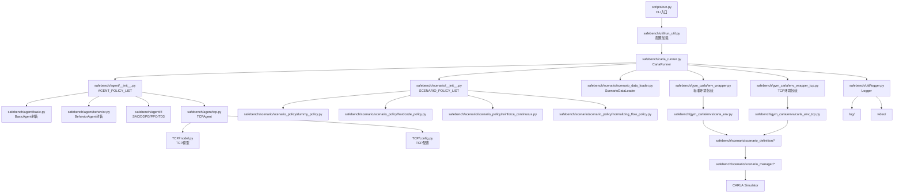

# 模块关系图

## 总览

## 分层说明

### 1. 入口层

- [scripts/run.py](../scripts/run.py)
- [safebench/util/run_util.py](../safebench/util/run_util.py)

负责命令行参数解析、配置加载和实验启动。

### 2. 调度层

- [safebench/carla_runner.py](../safebench/carla_runner.py)

负责：

- 连接 CARLA
- 按地图初始化 world
- 初始化渲染器
- 装配 agent / scenario policy
- 创建并行环境
- 切换训练/评测模式

### 3. Agent 层

- [safebench/agent/__init__.py](../safebench/agent/__init__.py)
- [safebench/agent/tcp.py](../safebench/agent/tcp.py)

统一管理被测自车策略。`TCPAgent` 通过桥接 [TCP](../TCP) 目录中的模型实现完成推理。

### 4. Scenario 层

- [safebench/scenario/__init__.py](../safebench/scenario/__init__.py)
- [safebench/scenario/scenario_data_loader.py](../safebench/scenario/scenario_data_loader.py)

负责场景策略注册、场景采样、路线去重和与 `scenario_manager` 的对接。

### 5. 环境层

- [safebench/gym_carla/env_wrapper.py](../safebench/gym_carla/env_wrapper.py)
- [safebench/gym_carla/env_wrapper_tcp.py](../safebench/gym_carla/env_wrapper_tcp.py)
- [safebench/gym_carla/envs/carla_env.py](../safebench/gym_carla/envs/carla_env.py)
- [safebench/gym_carla/envs/carla_env_tcp.py](../safebench/gym_carla/envs/carla_env_tcp.py)

负责将 CARLA 场景包装成统一的 Gym 风格接口。TCP 分支额外支持：

- 原始分辨率相机图像
- TCP 所需观测结构
- 自定义传感器配置

### 6. 结果输出层

- [safebench/util/logger.py](../safebench/util/logger.py)

负责：

- 配置持久化
- 训练/评测结果存储
- 视频帧录制与导出
- 控制台日志输出

## 推荐理解顺序

建议按下面顺序读代码：

1. [scripts/run.py](../scripts/run.py)
2. [safebench/carla_runner.py](../safebench/carla_runner.py)
3. [safebench/agent/__init__.py](../safebench/agent/__init__.py)
4. [safebench/scenario/__init__.py](../safebench/scenario/__init__.py)
5. [safebench/gym_carla/env_wrapper.py](../safebench/gym_carla/env_wrapper.py)
6. [safebench/gym_carla/envs/carla_env_tcp.py](../safebench/gym_carla/envs/carla_env_tcp.py)
7. [safebench/scenario/scenario_manager](../safebench/scenario/scenario_manager)
